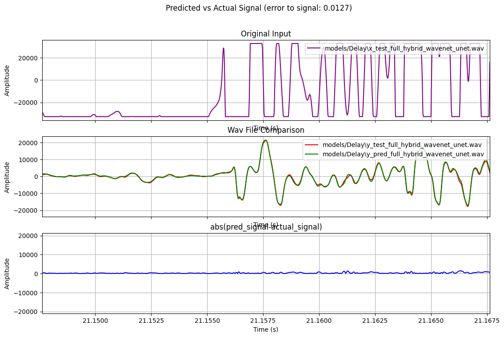

### CloneAnyTone

Neural audio modeling for guitar effects with hybrid architectures:
- Hybrid WaveNet U-Net Transformer backbone with optional learnable IR branch (frequency-domain fast convolution)
- Robust, overlap-add (OLA) reconstruction for seamless long-form audio

Able to clone guitar tone (including tones produced with multiple pedals) using a few minutes of original and transformed recordings. Purpose-built to extend time-invariant or short-term temporal guitar effects (e.g., overdrive, distortion, EQ) to model long-term temporal dependencies (e.g., reverb, delay, echo). Current successful experiments include cloning overdrive, distortion, various amplifier heads, delay, and reverb.

This repository focuses on training and evaluating effect models such as Overdrive, Reverb, and Delay from paired dry/wet audio.

### Quickstart Results

After training the `hybrid_wavenet_unet` model, you can visualize its performance:



Signal Comparison of Delay Model


Signal Comparison of Overdrive + Reverb Model

### Repository Structure
- `prepare.py`: Create training datasets from paired dry/wet `.wav` files (44.1 kHz mono recommended)
- `trainHybrid.py`: Train models (`transformer`, `hybrid`, `hybridplus`, `hybrid_wavenet_unet`)
- `testHybrid.py`: Run inference on prepared datasets and export `.wav` outputs; supports `--data` and `--data_filename`
- `plot.py`: Generate analysis plots and error metrics from saved test results
- `modelTransformer.py`: Model definitions (WaveNet, Transformer, U-Net hybrid, learnable IR branch)
- `preparedData/`: Default location for serialized datasets (`.pickle`)
- `models/`: Checkpoints and analysis artifacts

### Requirements
- Python 3.10+
- PyTorch, NumPy, SciPy, tqdm, TensorBoard, Matplotlib

Install the dependencies in your environment, for example:
```powershell
pip install torch numpy scipy tqdm tensorboard matplotlib
```

### Quickstart (Windows PowerShell)

#### 1) Prepare datasets
- DelayOnly
```powershell
python prepare.py data/dataset_clean_New.wav data/dataset_delay_New.wav --out_dir preparedData --out_name DelayOnly.pickle
```

- Overdrive+Reverb+Delay
```powershell
python prepare.py data/dataset_clean_New.wav data/dataset_overdrive_reverb_delay_New.wav --out_dir preparedData --out_name Overdrive+Reverb+Delay.pickle
```

Preparation notes:
- Can be skipped if not using self-recorded dataset.
- Default sample rate is 44.1 kHz. Stereo inputs are averaged to mono.
- Default segment length is 88200 samples (2.0 s) with 50% overlap (hop 44100).
- Data are normalized and standardized (x only) with training-set statistics.

#### 2) Train
- Hybrid WaveNet U-Net with IR branch
```powershell
python trainHybrid.py --model models/Delay/HybridWUNet.ckpt --model_type hybrid_wavenet_unet --data preparedData/Overdrive+Reverb+Delay.pickle --use_ir --ir_length 44100 --ir_wet 0.25
```

Other examples:
- Transformer (short segments)
```powershell
python trainHybrid.py --model models/pedalHybrid/Transformer.ckpt --model_type transformer --data preparedData/DelayOnly.pickle
```

- Hybrid
```powershell
python trainHybrid.py --model models/pedalHybrid/Hybrid.ckpt --model_type hybrid --data preparedData/Overdrive+Reverb+Delay.pickle
```

- HybridPlus
```powershell
python trainHybrid.py --model models/pedalHybrid/HybridPlus.ckpt --model_type hybridplus --data preparedData/Overdrive+Reverb+Delay.pickle
```

Optional: force CPU
```powershell
--cpu
```

#### 3) Test / Inference
- Using a dataset filename from `preparedData/`
```powershell
python testHybrid.py --model models/Overdrive+Reverb+Delay/Overdrive+Reverb+Delay.ckpt --model_type hybrid_wavenet_unet --data_filename Overdrive+Reverb+Delay.pickle --use_ir
```

- Or pass a full dataset path
```powershell
python testHybrid.py --model models/pedalHybrid/Transformer.ckpt --model_type transformer --data preparedData/DelayOnly.pickle
```

Outputs (under the model directory):
- `y_pred_full_<model_type>.wav`, `x_test_full_<model_type>.wav`, `y_test_full_<model_type>.wav`
- If `--use_ir` and the model exposes a learnable IR: `learned_ir_<model_type>.png` and `.npy`

#### 4) Plot results
```powershell
python plot.py --model models/Overdrive+Reverb+Delay/Overdrive+Reverb+Delay.ckpt --model_type hybrid_wavenet_unet
```
Optional interactive window:
```powershell
--show
```

### Acknowledgements
This project reuses and adapts ideas and portions of code inspired by GuitarML's PedalNetRT. See the original repository for context and references: [GuitarML/PedalNetRT](https://github.com/GuitarML/PedalNetRT).